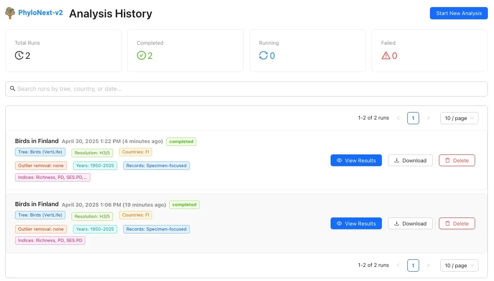

= PhyloNext v2 web-GUI documentation
:showtitle:
:page-title: PhyloNext v2
:page-description: Overview and usage instructions for PhyloNext v2

[.grid-container]
----
image::images/MainUI.webp[PhyloTwin React UI screenshot, alt="Screenshot of PhyloTwin React UI", width="100%"]
----

== Overview

PhyloNext is a user interface for the PhyloTwin biodiversity analysis pipeline. Key features include:

* Interactive parameter selection and data uploads
* Visualizations of diversity estimates
* Side-by-side comparisons with swipe controls
* Exportable visualizations including legends

== Getting Started

== Workflow

[.grid-container]
----
image::images/Workflow.webp[System workflow diagram, alt="Workflow diagram of PhyloTwin React" , width="100%"]
----

== Results Visualization

[.grid-container]
----
image::images/Results_visualization.webp[Results visualization, alt="Results visualization in PhyloTwin" , width="100%"]
----

== Comparative Analysis

[.grid-container]
----
image::images/Comparative_analysis.webp[Comparative analysis, alt="Comparative analysis features" , width="100%"]
----

== Analysis History

[.grid-container]
----

----

== License

This project is licensed under the MIT License. See https://opensource.org/licenses/MIT[MIT License]. 

