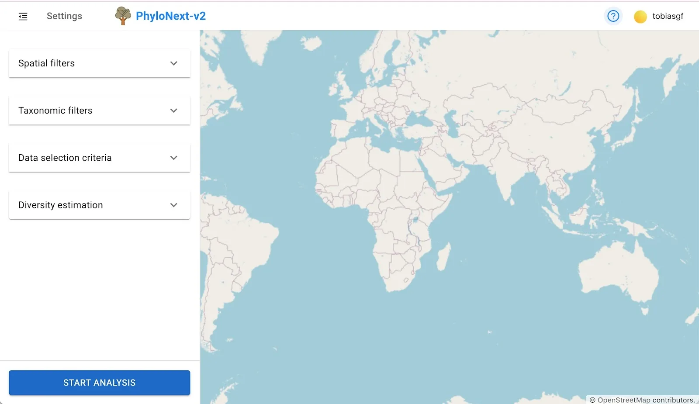
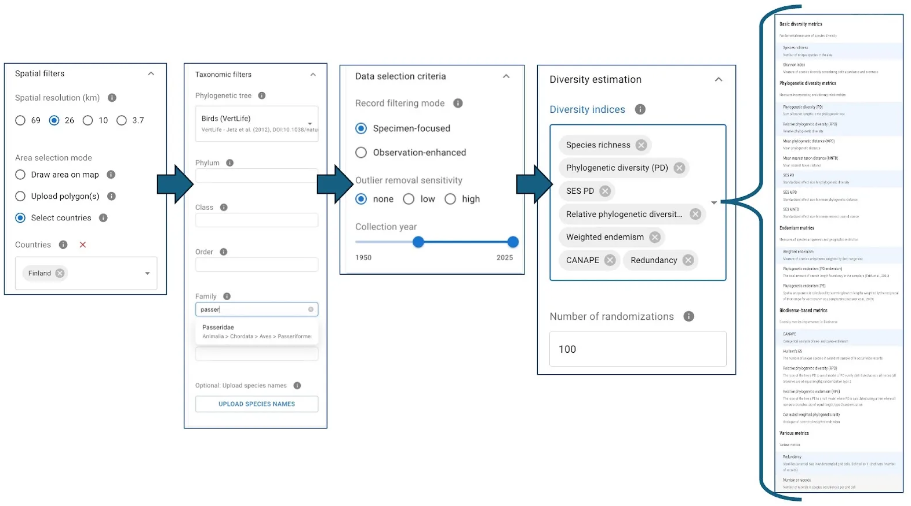
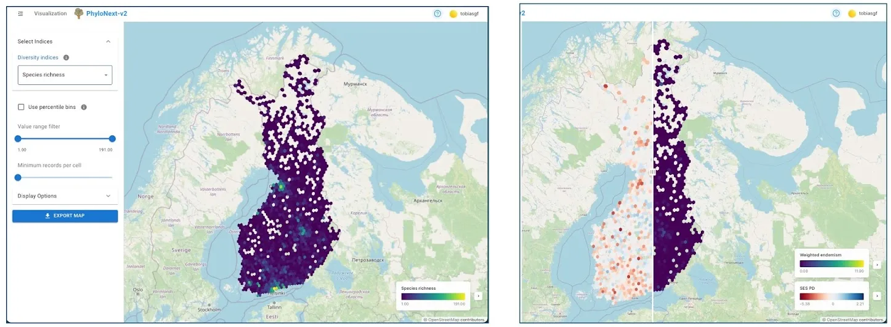
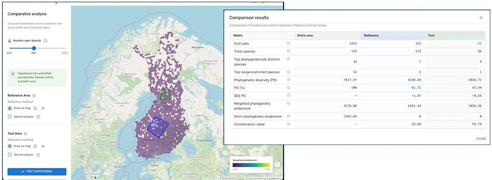

# PhyloNext v2 web-GUI documentation

## Overview

PhyloNext is a user interface for the PhyloTwin biodiversity analysis pipeline. Key features include:

* Interactive parameter selection and data uploads
* Visualizations of diversity estimates
* Side-by-side comparisons with swipe controls
* Exportable visualizations including legends

## Getting Started

## Workflow

## Results Visualization

## Comparative Analysis

## Analysis History

## License

This project is licensed under the [MIT License](https://opensource.org/licenses/MIT).
